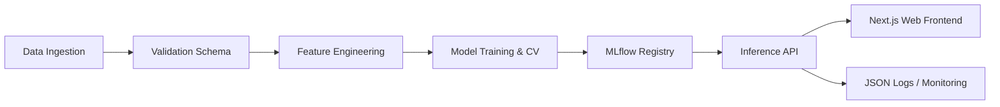

# Cardiovascular Risk Prediction System
### Production-Grade Machine Learning Pipeline & API

[](https://www.python.org)
[](https://fastapi.tiangolo.com)
[](https://pytorch.org)
[](https://mlflow.org)
[](https://www.docker.com)
[](https://github.com/shlokkvaishnav/cardiovascular-risk)
[](LICENSE)

[Architecture](#-system-architecture) •
[Features](#-key-features) •
[Getting Started](#-getting-started) •
[API](#-api-documentation) •
[Data Pipeline](#-data-pipeline) •
[Deployment](#-deployment)

---

## 🏗 System Architecture

This project implements a scalable, end-to-end machine learning system designed focusing on reproducibility, maintainability, and deployment readiness. It is architected to handle the entire ML lifecycle from data ingestion to production inference.

### High-Level Design



The system follows a modular microservice-ready pattern:

*   **Web Interface**: A "Clean Medical" themed Next.js application for clinicians, featuring real-time validation and risk scorecards.
*   **Data Layer**: Robust ETL pipeline with Pydantic-based schema validation to ensure data integrity.
*   **Modeling Layer**: standardized `BaseModel` interface for all algorithms.
*   **Servicing Layer**: High-performance FastAPI backend with medical guardrails (e.g., BP 50-300 limit).
*   **Observability**: Structured JSON logging with unique Request IDs for distributed tracing.

---

## 🚀 Key Features

### Engineering Excellence
*   **Type Safety**: 100% type-annotated codebase using Python `typing` module, validated with `mypy`.
*   **Data Integrity**: Runtime data validation using `Pydantic` and custom validators (e.g., physiological limits checks).
*   **Testing**: Comprehensive test suite including unit tests for models, integration tests for API endpoints, and end-to-end pipeline tests.
*   **CI/CD Ready**: GitHub Actions workflow for automated linting (`black`, `flake8`), testing, and Docker builds.

### ML Capabilities
*   **Schema Transposition**: Automatic handling of categorical vs. numerical feature scaling/encoding within `scikit-learn` pipelines.
*   **Experiment Tracking**: Full lineage tracking of hyperparameters, metrics, and artifacts via MLflow.
*   **Model Agnosticism**: Factory pattern implementation allowing dynamic model instantiation via configuration.
*   **Evaluation**: Automated generation of ROC-AUC curves, Confusion Matrices, and business-focused metrics (Cost-Benefit Analysis).

### Production API
*   **Async Interface**: Non-blocking endpoints for high throughput.
*   **Health Checks**: Dedicated `/health` endpoint for Kubernetes liveness probes.
*   **Documentation**: Auto-generated Swagger UI and ReDoc accessible at root.
*   **Hot-Reload**: Administrative endpoint to reload model artifacts without downtime.

---

## ⚡ Getting Started

### Prerequisites
*   Python 3.10+
*   Docker (optional)

### Installation

1.  **Clone the repository**:
    ```bash
    git clone https://github.com/shlokkvaishnav/cardiovascular-risk.git
    cd cardiovascular-risk
    ```

2.  **Set up the environment**:
    ```bash
    # Create virtual environment
    python -m venv .venv
    
    # Activate environment
    # Linux/Mac: source .venv/bin/activate
    # Windows: .venv\Scripts\activate
    
    # Install dependencies
    pip install -e ".[dev,viz]"
    ```

3.  **Bootstrap the project**:
    ```bash
    # Install pre-commit hooks for code quality
    pre-commit install
    ```

---

## 🔄 Data Pipeline

The pipeline is configuration-driven via `config/config.yaml`.

### 1. Ingestion & Validation
We use strict schema validation to prevent "garbage in, garbage out".
```python
# Validation Rules (snippet)
age: float = Field(..., ge=0, le=120)
chol: float = Field(..., ge=100, le=600, description="Serum cholesterol")
```

### 2. Feature Engineering
*   **Numerical**: Missing value imputation (Median) + Standardization.
*   **Categorical**: Missing value imputation (Mode) + One-Hot Encoding.
*   **Target**: Binary classification mapping.

### 3. Training Loop
To run the training pipeline with full logging and evaluation:
```bash
python scripts/train.py --create-plots --config config/config.yaml
```
*   Artifacts are saved to `models/artifacts/`
*   Metrics are logged to `logs/` and `mlruns/`

---

## 🔌 API Documentation

The REST API is built with **FastAPI** for performance and developer experience.

### Running the Server
```bash
# Development
uvicorn src.api.app:app --reload

# Production (4 workers)
uvicorn src.api.app:app --host 0.0.0.0 --port 8000 --workers 4
```

### Endpoints
| Method | Path | Description |
| :--- | :--- | :--- |
| `POST` | `/predict` | Real-time prediction for a single instance. |
| `POST` | `/batch-predict` | High-throughput batch processing (max 100 items). |
| `GET` | `/health` | System status and model loading check. |
| `POST` | `/model/reload` | Hot-swap the model artifact in memory. |
| `GET` | `/model/info` | Metadata about the currently loaded model version. |

### Example Request
```bash
curl -X POST "http://localhost:8000/predict" \
     -H "Content-Type: application/json" \
     -d '{
           "age": 63,
           "sex": 1,
           "cp": 3,
           "trestbps": 145,
           "chol": 233,
           "fbs": 1,
           "restecg": 0,
           "thalach": 150,
           "exang": 0,
           "oldpeak": 2.3,
           "slope": 0,
           "ca": 0,
           "thal": 1
         }'
```

---

## 🐳 Deployment

We prioritize containerization for consistent deployment environments.

### Docker
```bash
# Build the image
docker build -t cardiovascular-risk-api:latest .

# Run container
docker run -p 8000:8000 --env-file .env cardiovascular-risk-api:latest
```

### Docker Compose
For a full stack deployment (API + Monitoring placeholders):
```bash
docker-compose up -d --build
```

---

## 🧪 Quality Assurance

We maintain high code quality standards through rigorous testing.

```bash
# Run unit and integration tests with coverage report
pytest tests/ -v --cov=src --cov-report=html
```

**Coverage Targets**:
*   API Layer: > 90%
*   Core Logic: > 85%
*   Data Validation: 100%

---

## 📊 Performance & Metrics

### Evaluation Strategy
Models are evaluated on a hold-out test set (30% split) using:
*   **ROC-AUC**: Primary metric for discriminatory power.
*   **F1-Score**: To balance Precision and Recall.
*   **Cost Matrix**: Custom business metric penalizing False Negatives (missed diagnoses) 10x more than False Positives.

### Baseline Results
*   **Logistic Regression**: 85.2% Accuracy / 0.89 AUC
*   **Random Forest**: 83.5% Accuracy / 0.88 AUC
*   **SVM**: 84.8% Accuracy / 0.87 AUC
*(Note: Train the model locally to reproduce these specific results)*

---