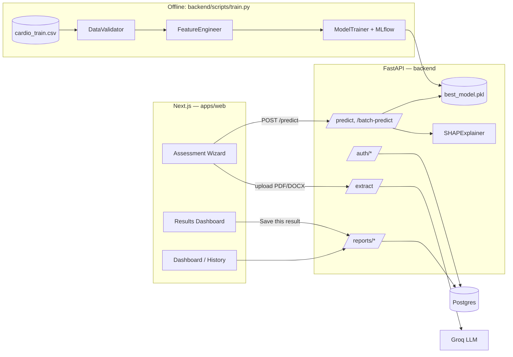

# CardioRisk — Explainable Cardiovascular Risk Platform

A full-stack ML application that estimates cardiovascular risk from lifestyle and vitals
data, explains every prediction with real SHAP values, and optionally tracks a user's risk
trend over time — built to demonstrate the full ML lifecycle: data validation → feature
engineering → model training/comparison → explainability → a real API → a production-style
frontend, containerized end to end.

## Why this exists

Most "heart disease predictor" portfolio projects stop at a Jupyter notebook. This one is a
real, running product: a FastAPI backend serving a trained model with genuine SHAP
explanations (not a static feature-importance list), a Next.js frontend that actually calls
that model (with a graceful fallback if it's unreachable), an optional accounts system with
Postgres-backed report history and PDF export, and an LLM-powered document upload that
auto-fills the assessment from an uploaded lab report.

## Architecture


```mermaid
flowchart LR
    subgraph Frontend [Next.js — apps/web]
        Wizard[Assessment Wizard]
        Results[Results Dashboard]
        Dash[Dashboard / History]
    end

    subgraph Backend [FastAPI — backend]
        Predict[/predict, /batch-predict/]
        Auth[/auth/*/]
        Reports[/reports/*/]
        Extract[/extract/]
        Explainer[SHAPExplainer]
        Model[(best_model.pkl)]
    end

    DB[(Postgres)]
    LLM[Groq LLM]

    Wizard -- POST /predict --> Predict
    Predict --> Model
    Predict --> Explainer
    Results -- Save this result --> Reports
    Dash --> Reports
    Auth --> DB
    Reports --> DB
    Wizard -- upload PDF/DOCX --> Extract
    Extract --> LLM

    subgraph Training [Offline: backend/scripts/train.py]
        Raw[(cardio_train.csv)] --> Validate[DataValidator] --> Engineer[FeatureEngineer] --> Train[ModelTrainer + MLflow] --> Model
    end
```

## Repository Layout

- `backend/` — FastAPI API, ML training pipeline, tests, model card
- `apps/web/` — Next.js frontend (guided wizard, results dashboard, dashboard/history)
- `docker-compose.yml` — full local stack: frontend + backend + Postgres

## Model Performance

Trained on the [Kaggle Cardiovascular Disease dataset](https://www.kaggle.com/datasets/sulianova/cardiovascular-disease-dataset)
(70,000 records, cleaned to 69,707 after repairing a systematic data-entry error in the raw
blood-pressure fields — see the model card). Five candidates (Logistic Regression, Random
Forest, LightGBM, XGBoost, and a Stacking ensemble) are tuned via Optuna and compared on
5-fold CV ROC-AUC; a cheap screening pass gives the full tuning budget only to candidates
still competitive after a fast untuned pass, cutting total training time from ~100 minutes to
~42 minutes. Full methodology (EDA, data cleaning, feature engineering, model selection,
fairness audit, explainability) in [`backend/MODEL_CARD.md`](backend/MODEL_CARD.md).

| Metric | Score |
|---|---|
| Accuracy | 73.9% |
| Precision | 75.8% |
| Recall | 70.1% |
| F1-Score | 72.9% |
| ROC-AUC | 0.804 |
| Brier Score (calibration) | 0.179 |

Every prediction includes real, signed SHAP contributions (`TreeExplainer` for the winning
model) — not a decorative feature-importance list. Probabilities are isotonic-calibrated, so a
predicted 30% risk means roughly 3 in 10 similar patients actually have the condition, not just
a well-ranked score.

### Business impact

The model optimizes for an asymmetric cost, not raw accuracy: a missed diagnosis (false
negative) is weighted **10x** an unnecessary follow-up (false positive), reflecting that the
clinical cost of the two error types isn't equal. On the 20,913-row held-out test set, this
pipeline's tuned model produces an average weighted cost of **1.60 per prediction** (down from
1.64 before this round's data-cleaning and model-selection improvements) — a concrete,
quantifiable metric the model is actually tuned against, surfaced live via `GET /model/info`.

## Quickstart (Docker)

Everything — frontend, backend, and Postgres — runs as containers. This is the only supported
local setup; there is no bare-metal `pip install`/`npm install` path documented here because
the whole point is reproducibility.

```bash
git clone <this-repo>
cd cardiovascular-risk
docker compose up -d --build
```

This will:
1. Build the backend image, which **trains a model as part of the build** (`RUN python
   scripts/train.py` in `backend/Dockerfile`) — no manual training step needed, and no
   trained-model binary committed to git.
2. Start Postgres, wait for it to be healthy, then start the API (which creates the
   accounts/report-history tables on first boot).
3. Build the frontend as a minimal standalone Next.js server image (`apps/web/Dockerfile`)
   and start it, proxying `/api/*` to the containerized backend over the Docker network.

Check it worked:

```bash
curl http://localhost:8000/health
# {"status":"healthy","model_loaded":true,...}

open http://localhost:3000
```

For local frontend development with hot reload instead of the built container, run it
separately against the containerized backend:

```bash
cd apps/web
npm install
NEXT_PUBLIC_API_URL=http://localhost:8000 npm run dev
```

### Environment variables

| Variable | Required | Purpose |
|---|---|---|
| `DATABASE_URL` | For accounts/reports | Postgres connection string (set automatically by `docker-compose.yml`) |
| `JWT_SECRET_KEY` | For accounts/reports | Signs auth tokens — set a real secret in production |
| `API_KEY` | Recommended in production | Protects `/predict`; defaults to a dev key locally |
| `GROQ_API_KEY` | For document upload | Powers the PDF/DOCX auto-fill feature; that feature returns a clear 503 if unset |
| `NEXT_PUBLIC_API_URL` | Frontend | Where the frontend proxies `/api/*` requests |

See `.env.example` for the full list.

## Key Features

- **Guided assessment wizard** — 7-step conversational flow with an optional "upload a lab
  report instead" path (LLM-powered extraction, user reviews before submitting).
- **Real-time results** — an instant client-side estimate appears first, then swaps in the
  authoritative, SHAP-explained model result once the backend responds; falls back gracefully
  with a clear banner if the backend is unreachable.
- **Optional accounts** — guests get the default zero-storage flow; logging in adds saved
  report history, a risk trend chart, and PDF export. Nothing about the guest flow changes.
- **Privacy-first by default** — no backend persistence unless a user explicitly saves a
  result while logged in.

## API Endpoints (Backend)

| Endpoint | Auth | Purpose |
|---|---|---|
| `POST /predict` | API key | Single prediction with SHAP explanation |
| `POST /batch-predict` | API key | Batch predictions (no per-row SHAP, for latency) |
| `GET /health` / `GET /model/info` | none | Health/introspection |
| `POST /model/reload` | none | Hot-reload the model artifact |
| `POST /auth/register` / `POST /auth/login` / `GET /auth/me` | — / JWT | Optional accounts |
| `POST /reports` / `GET /reports` / `GET /reports/{id}` / `GET /reports/{id}/pdf` | JWT | Saved report history + PDF export |
| `POST /extract` | none | Upload a PDF/DOCX lab report, get extracted values back for review |
| `GET /metrics` | none | Prometheus metrics (request latency/volume + prediction distribution) |

## Monitoring

`docker compose up` also starts Prometheus (`:9090`) and Grafana (`:3001`, login `admin`/`admin`),
pre-provisioned with a dashboard covering request rate, p50/p95 latency, 5xx errors, and two
ML-specific panels: prediction volume by risk level and the predicted-probability distribution
— cheap proxies for spotting model or input drift over time. `backend/scripts/drift_check.py`
does a simple mean-shift comparison against the training distribution, reusing
`DataValidator`'s existing statistical profiling rather than adding a dedicated drift-detection
dependency, and runs automatically every Monday via
[`.github/workflows/drift-check.yml`](.github/workflows/drift-check.yml) (also triggerable
on-demand from the Actions tab) — non-blocking by design, it surfaces drift for humans to
review rather than auto-failing the build.

## Data Versioning (DVC)

The raw dataset and every trained-model artifact are tracked with [DVC](https://dvc.org)
(`backend/dvc.yaml`), not committed to git directly:

```bash
cd backend
dvc pull            # fetch the tracked raw data + latest trained model from the remote
dvc repro           # re-run the training pipeline only if a dependency (data, config, or
                     # pipeline code) actually changed since the last run
dvc push            # publish newly produced artifacts to the remote
```

The pipeline's dependency graph (`dvc.yaml`) declares exactly what feeds the `train` stage
(raw data, config, and every pipeline source file) and what it produces
(`best_model.pkl`, `shap_background.pkl`, `training_metadata.json`, evaluation metrics) — so
`dvc status`/`dvc repro` can tell you precisely whether a retrain is actually needed, not just
whether someone remembered to run the script.

## Quality Checks

```bash
# Backend tests (run inside the built image, or with tests/ mounted)
docker run --rm -v "$(pwd)/backend/tests:/app/tests" cardio-api:dev pytest tests/ -v

# Frontend
cd apps/web
npm run lint
npx vitest run
npm run build
```

CI (`.github/workflows/pipeline.yml`) runs all of the above plus a Docker build + `/health`
smoke test on every push/PR.

## License

MIT (`LICENSE`)
